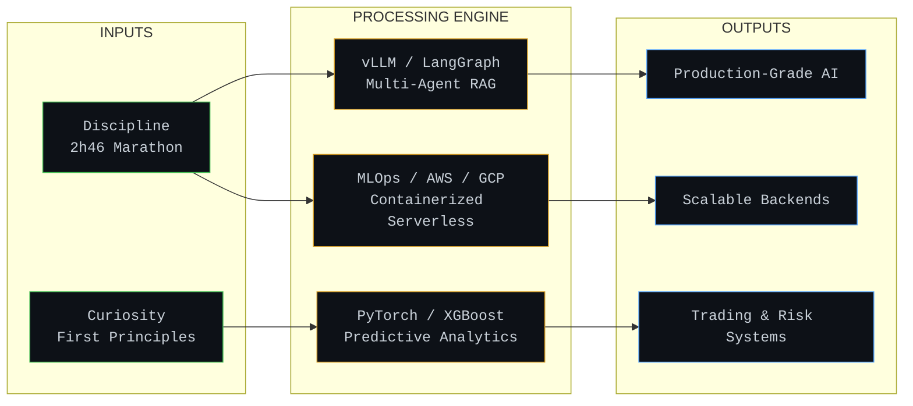

  <pre>
   _____ ______ _  __  ____ __  __   __   __   ___  
  / ___// ____/| |/ / / __ \ \/ /  / /  / /  ( _ ) 
  \__ \/ __/   |   / / / / / \  /  / /_ / /_ / __ \ 
 ___/ / /___  /   | / /_/ /  / /  / __// __// /_/ / 
/____/_____/ /_/|_| \____/  /_/  /_/  /_/   \____/  
  </pre>
  
  
<b>NICOLAS EDMOND</b> | <code>ML / AI Engineer</code> | <code>Bordeaux, France</code>

  
<i>Building production-grade AI systems from first principles.</i>

---
### ▻ SYSTEM_ARCHITECTURE: The Data Pipeline

---
### ▻ CORE_MODULES: Featured Deployments

| Module | Description | Stack |
|:---|:---|:---|
| <code><a href="https://github.com/Sekoya88/multimodal-alpha-signal-extractor">multimodal-alpha-signal</a></code> | <b>VLM + Sentiment Pipeline.</b> Fine-tuned Qwen2.5-VL-3B on candlestick charts + NLP sentiment scoring for live trading signals. | `vLLM`, `llama.cpp`, `Unsloth`, `LangChain` |
| <code><a href="https://github.com/Sekoya88/Agentic-Credit-Geopolitical-Risk">agentic-risk-assessment</a></code> | <b>Multi-Agent LLM Pipeline.</b> Orchestrates 3 specialized autonomous agents to generate CRO-level integrated risk reports in <60s. | `LangGraph`, `Gemini 2.5 Flash`, `ChromaDB` |
| <code><a href="https://github.com/Sekoya88/EcoChain">ecochain</a></code> | <b>Sustainable Ledger System.</b> Custom implementation details integrating localized predictive analytics and robust backend infrastructure. | `Python`, `PostgreSQL`, `Docker` |

---
### ▻ TELEMETRY: System Status

  
  

 

  <code>[SYSTEM STATUS: ONLINE]</code> | <code>[TARGET: CONTINUOUS DEPLOYMENT]</code> | <a href="https://www.linkedin.com/in/nicolas-edmond"><code>[CONNECT: LINKEDIN]</code></a>

